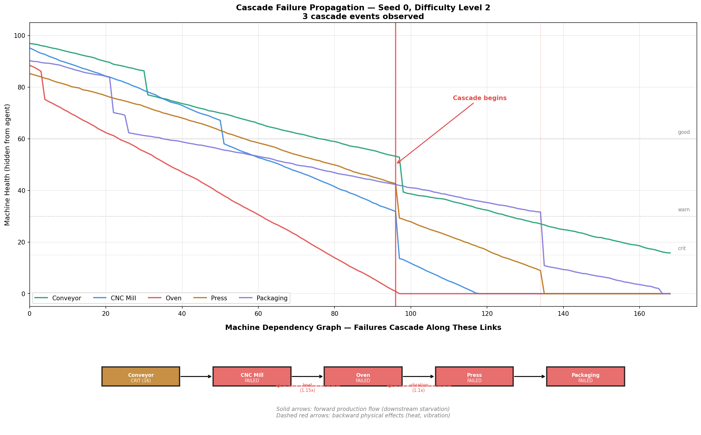
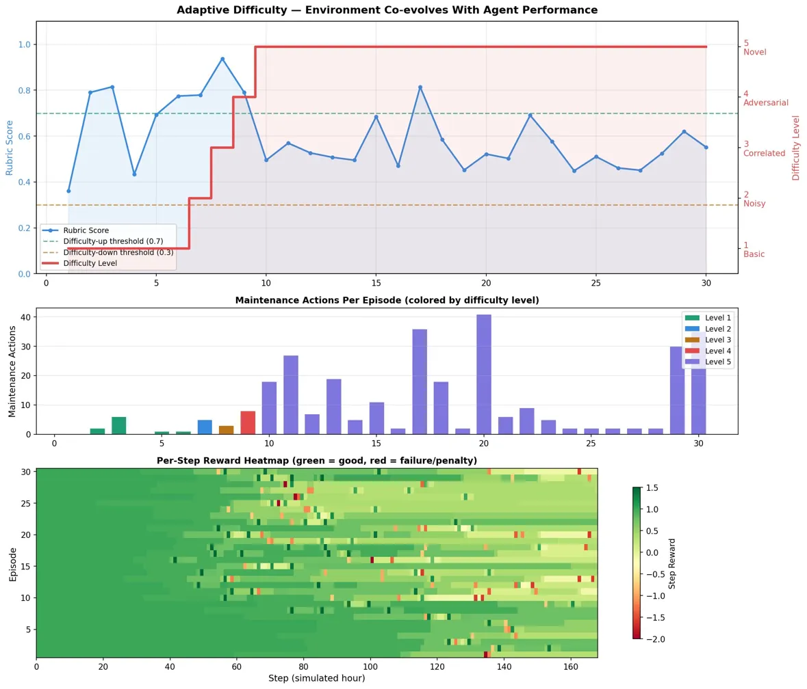
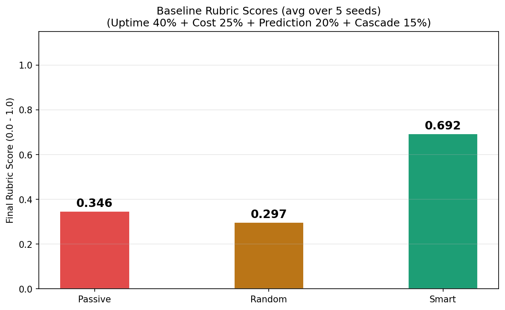
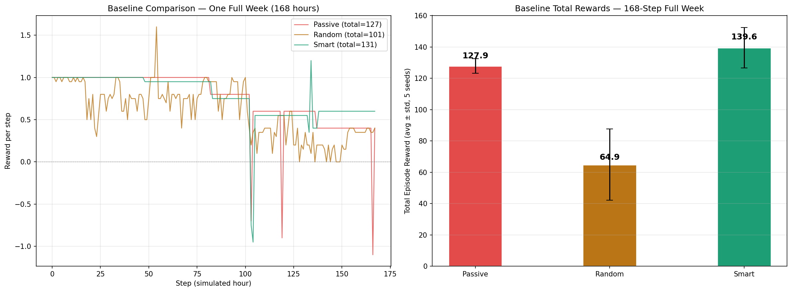
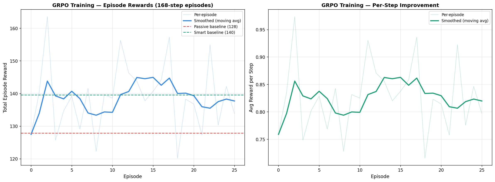
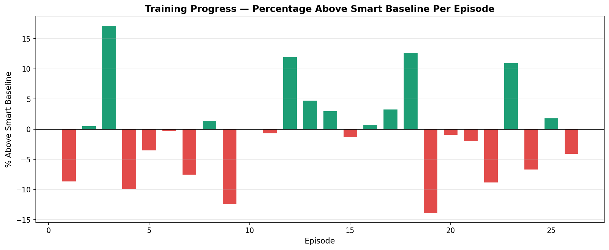
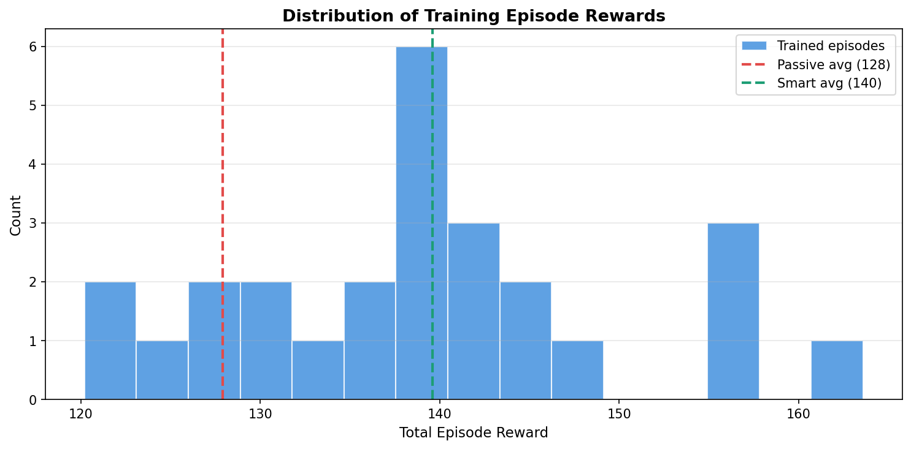

# Predictive Maintenance Arena

**An OpenEnv reinforcement learning environment where LLM agents learn to keep a factory alive.**

Meta PyTorch × HuggingFace OpenEnv Hackathon — Grand Finale, April 2026


OpenEnv Themes: World Modeling (3.1) + Self-Improvement (4)

---

## The Problem

Unplanned machine downtime costs the world’s 500 biggest companies 11% of their revenues, which equates to $1.4 trillion, according to 'The True Cost of Downtime 2024' [report](https://assets.new.siemens.com/siemens/assets/api/uuid:1b43afb5-2d07-47f7-9eb7-893fe7d0bc59/TCOD-2024_original.pdf) by Siemens. The cost is not only financial. It is felt by the engineer who receives a 3 AM call when a bearing fails, by the customer whose order is delayed, and by the factory team left facing a silent production floor while they work to understand what went wrong.

The frustrating part is that most of these failures are not sudden. Machines usually warn us before they break. A motor starts running a little hotter than normal. A vibration reading shifts just enough to matter. Power consumption slowly climbs over the course of a week. Each signal looks small on its own, but together they tell a story. The challenge is noticing that story early enough to act.

Today, predictive maintenance still depends heavily on experienced engineers who have learned, over years, how to read the subtle patterns machines give off. They walk the factory floor, listen for changes in sound, study dashboards, and make careful judgment calls. One machine can wait until Friday. Another needs attention now. And if the oven is ignored for too long, it may not fail alone; it could bring the press downstream with it.

This project asks a direct question: can we teach an AI agent to develop that same intuition by managing a simulated factory thousands of times, learning from every mistake, every missed warning, every prevented disaster?

The Predictive Maintenance Arena is the training ground where that learning happens.

---

## Why I Built This

I am a [data scientist](https://linkedin.com/in/shubhankamat) at a British Company focussing on time series analysis, where I have worked with stakeholders in the manufacturing sector, and analysed sensor data from various factory floors, including presses, kilns and more. 

The design of this environment draws directly from those experiences, the sensor noise patterns, the potential risk of cascade failures across shared infrastructure, the potential resource constraints of having limited maintenance crew and limited spare parts. 

This environment is built around a principle I observed in my work: factories fail as systems, not as isolated machines. One machine drags down the next, resource constraints force prioritization, and the cost of inaction compounds over time. The environment combines cascade dependencies, partial observability, composable multi-objective rewards, and adaptive difficulty into a single training ground for LLM agents.
---

## The Factory Setup

Five machines are arranged in a sequential production line. Raw material enters Machine 0, passes through four processing stages, and exits Machine 4 as a finished product. Each machine has its own way of wearing out, its own sensors, and its own failure mode.

**Machine 0 — Conveyor Belt.** The conveyor belt is the first link in the production line, moving raw materials into the factory process. If it stops, the entire line is starved before production even begins. Its wear comes from constant mechanical friction as belts stretch, rollers develop flat spots, and motors draw more power when bearings begin to degrade. The environment tracks this through vibration, temperature, and power draw sensors. The conveyor degrades slowly at 0.3 health points per hour, but the cost of ignoring it is high: a planned repair costs $1,200 and takes 4 hours, while a failure costs $8,000 and takes 12 hours to recover from.

**Machine 1 — CNC Milling Machine.** The CNC mill shapes raw material with computer-controlled cutting tools, making it one of the most precise machines in the line. It is also one of the most sensitive. Small changes in vibration, temperature, or cutting pressure can quickly affect alignment, tool wear, and part quality. A slight drift may be enough to produce defective components before the problem becomes obvious. The environment tracks the CNC mill through vibration, temperature, and pressure sensors. It degrades at 0.5 health points per hour, with a scheduled repair costing $2,500 and taking 6 hours. If it fails unexpectedly, recovery is far more expensive: $15,000 and 18 hours of downtime.

**Machine 2 — Heat Treatment Oven.** The heat treatment oven hardens shaped material by operating continuously at 150–200°C. It is the most demanding machine in the line because its components are exposed to sustained thermal stress hour after hour. Over time, heating elements weaken, power draw changes, and temperature control becomes less reliable. When the oven fails, the impact can be severe: it can halt production directly and also place nearby machines under additional heat stress. The environment tracks the oven through vibration, temperature, and power draw sensors. It degrades at 0.7 health points per hour, the fastest rate in the factory. A scheduled repair costs $3,000 and takes 8 hours, while an unexpected failure costs $20,000 and requires a full day of downtime.

**Machine 3 — Hydraulic Press.** The hydraulic press uses immense pressure to form the material into its final shape. Inside, it depends on a closed hydraulic system of fluid, pumps, seals, and valves, all working under constant load. Wear usually builds slowly: seals begin to weaken, small leaks appear, and pressure starts to drift before anything visibly breaks. But when a seal finally fails, the damage is sudden and messy, with fluid leaks, cleanup time, and a halted production line. The environment tracks the press through vibration, pressure, and acoustic sensors. It degrades at 0.4 health points per hour. A scheduled repair costs $2,000, while an unexpected failure costs $12,000.

**Machine 4 — Packaging Unit.** The packaging unit wraps, labels, and palletizes finished products before they leave the factory. It is simpler than the larger machines upstream, but it relies on many small moving parts working in sync, including grippers, short conveyors, label applicators, and alignment mechanisms. Any one of these can jam, slip, or wear out on its own. Because of this, the packaging unit may run into issues often, but those issues are usually cheaper and faster to fix than failures elsewhere in the line. The environment tracks it through vibration, temperature, and power draw sensors. It degrades at 0.25 health points per hour, the slowest rate in the factory. A scheduled repair costs $800, while an unexpected failure costs $5,000.


---

## How Failures Cascade

The machines form a connected production line where each station depends on the one before it and feeds the one after it. When one machine fails, the impact moves through the line, disrupting production and placing stress on the machines around it.

```
Conveyor ──→ CNC Mill ──→ Heat Oven ──→ Hydraulic Press ──→ Packaging
                 ↑            │  ↑            │
                 └──(heat)────┘  └─(vibration)─┘
```

**Forward cascades** follow the production flow. If the conveyor stops, the CNC mill has nothing to cut. The oven has nothing to heat. The entire downstream line goes idle, burning money every hour it sits silent.

**Backward cascades** follow physical coupling. The oven radiates heat to the CNC mill positioned nearby, accelerating its degradation (1.15× stress multiplier). The hydraulic press transmits vibration through the factory floor to the oven, disrupting its temperature control (1.1× stress multiplier).

When a machine fails, connected machines take 5–20 points of health damage and their degradation rate increases permanently. A single unaddressed failure can cascade through the entire line within hours.

The following plot demonstrates this in a controlled experiment where the factory runs with no agent intervention at difficulty level 2, which is one of five adaptive difficulty levels the environment supports, with increased sensor noise and intermittent failures compared to the default (see [Adaptive Difficulty](#adaptive-difficulty--the-self-improvement-mechanism) below for full details):



*Figure 1: Machine health trajectories over 168 simulated hours (one week). The oven (red) fails first at step 96. The failure immediately cascades to the CNC mill (−18 health) and hydraulic press (−13 health). The press subsequently fails at step 134 and cascades to the packaging unit (−20 health). By the end of the week, only the conveyor survives, in critical condition. The dependency graph at the bottom shows the exact propagation paths with stress multipliers and final machine states.*

This is why the agent cannot think about machines in isolation. Every maintenance decision is a system-level decision.

---

## What the Agent Sees

The agent operates under the same information constraints as a real maintenance engineer. The agent works with incomplete, noisy data and must make decisions under uncertainty.

**Sensor readings.** Every simulated hour, each machine reports 3–4 sensor values: vibration in mm/s, temperature in °C, pressure in bar, acoustic level in dB, or power consumption in kW. These readings also include Gaussian noise, which are random fluctuations that make it difficult to distinguish a genuine 2-degree temperature increase from normal variation. At higher difficulty levels, the noise increases further, and intermittent spikes create false alarms.

**Coarse health indicator.** Each machine shows a traffic-light status: "good" (health ≥ 60), "warn" (health 30–60), or "crit" (health < 30). But the agent never sees the actual hidden health value which is a continuous number from 0 to 100. A machine may show "good" while its health silently drops from 95 to 61. By the time the indicator switches to "warn," the optimal maintenance window may have passed and the repair is now twice as expensive. The agent must learn to detect degradation trends in noisy sensor trajectories rather than simply reacting to status labels.

**Resource state.** The agent sees whether the maintenance crew is available or busy, which spare parts are in stock, which parts are on order and when they will arrive, current production output versus target, and a log of recent events.

---

## What the Agent Can Do

Every simulated hour, the agent selects one of six actions:

| Action | Reward Effect | When to Use It |
|--------|--------------|----------------|
| `monitor` | 0.0 | Everything looks healthy. Free but passive, doing nothing when a machine is secretly degrading is how cascade failures start. |
| `run_diagnostic` | −0.05 | Sensor readings look suspicious. Spending time and money to test a machine reveals estimated remaining life and component-level readings, this is the information the noisy sensors cannot provide on their own. |
| `schedule_maintenance` | +0.8 if needed, −0.3 if unnecessary | A machine is degrading and should be taken offline for preventive repair before it fails. Timing matters. Too early wastes money, too late risks cascade damage. |
| `emergency_shutdown` | −0.2 | A machine is about to fail catastrophically. This stops the machine immediately, preventing cascade damage but halting production. |
| `order_parts` | −0.05 | Spare parts are running low. Parts take 6–12 hours to arrive. If the agent waits until a machine fails to order parts, the repair takes much longer. Smart agents order parts before they are needed. |
| `adjust_speed` | 0.0 | Multiple machines are degrading and the crew is already busy. Slowing the line (50–100%) reduces wear on all machines simultaneously this trades short-term production for long-term reliability. |

**Resource constraints shape every decision.** There is one maintenance crew, so if Machine 2 and Machine 4 both need attention, the agent must decide which one to fix first. Spare parts are finite and must be ordered in advance. Maintenance restores health only when the crew finishes the repair and not when the order is placed. These constraints force the agent to plan ahead, prioritize, and accept trade-offs.

---

## Reward Design

The environment provides two layers of feedback: a dense per-step reward for immediate learning signal, and a composite rubric score for holistic evaluation.

### Per-Step Reward (Dense Signal)

Every hour, the agent receives:
- **+0.2 per running machine** (maximum +1.0 when all five are operational)
- **Action-specific reward** from the table above
- **−1.5 per machine that fails during this step** (only counted once, at the moment of failure, not every subsequent step)
- **−5.0 if all five machines fail simultaneously** (total line shutdown)

This gives the training algorithm a clear signal at every decision point.

### End-of-Episode Rubric (Composite Evaluation)

At the end of each 168-step episode (one simulated week), four composable rubrics evaluate the agent's overall performance using OpenEnv's `WeightedSum` container:

| Rubric | Weight | What It Measures | Why It Exists |
|--------|--------|-----------------|---------------|
| **UptimeRubric** | 40% | units_produced / production_target | Production uptime pays the bills. The most important metric in real manufacturing. |
| **CostRubric** | 25% | 1.0 − (total_cost / 50,000) | A maintenance strategy that costs more than the failures it prevents is not useful. Real factories have budgets. |
| **PredictionRubric** | 20% | correct_maintenance / total_maintenance_attempts | Rewards agents that correctly identify machines needing attention. Returns 0.0 if the agent never attempts maintenance, inaction is not neutral. |
| **CascadeRubric** | 15% | prevented_cascades / total_cascade_risk | Cascade failures cause 10× the damage of single-machine failures. An agent that prevents cascades is worth its weight in gold. |

**The rubric design is intentionally hard to game.** An agent that maintains every machine every day scores well on Uptime but poorly on Cost and Prediction (most maintenance is unnecessary). An agent that never maintains scores 0.0 on Prediction. An agent that ignores cascade risk scores poorly on Cascade. The optimal strategy requires balancing all four objectives simultaneously.

---

## Adaptive Difficulty — The Self-Improvement Mechanism

Most training environments present fixed challenges. Once an agent masters them, learning plateaus. The Predictive Maintenance Arena co-evolves with the agent through an adaptive difficulty system with five levels.

| Level | Name | What Changes |
|-------|------|-------------|
| 1 | Basic | Single-machine failures, clear sensor patterns, ample spare parts |
| 2 | Noisy | Sensor noise increases (×1.3), intermittent failures that appear and resolve |
| 3 | Correlated | Multi-machine degradation from shared root causes, sensor baseline drift, reduced spare parts |
| 4 | Adversarial | Misleading sensor readings, simultaneous failures, production pressure |
| 5 | Novel | Previously unseen failure mode combinations, all effects active |

Difficulty adjusts automatically based on a rolling three-episode average of the agent's rubric score. Scoring above 0.7 consistently triggers escalation. Scoring below 0.3 triggers reduction. The difficulty history persists across `reset()` calls within the same environment instance, enabling continuous curriculum progression during training.

The following plot demonstrates the system in action. A fixed rule-based agent (the "smart" baseline) runs 30 consecutive episodes on the same environment instance:



*Figure 2: Top panel — Rubric score (blue) and difficulty level (red) over 30 episodes. The agent scores above the 0.7 threshold (green dashed line) in early episodes, triggering escalation from level 1 through 2, 3, 4, reaching maximum difficulty (level 5) by episode 10. Performance drops from 0.93 to ~0.5 as the environment generates harder challenges. Middle panel — Maintenance actions per episode, colored by difficulty level. The agent needs significantly more maintenance at higher difficulties (up to 41 actions at level 5 vs 2 at level 1). Bottom panel — Per-step reward heatmap across all 30 episodes. Green regions indicate healthy production; red patches indicate failures and penalties. The increasing density of red at higher difficulty levels (episodes 10+) shows the environment generating genuinely harder scenarios.*

Both the cascade propagation and adaptive difficulty visualizations can be reproduced by running python demo_features.py from the environment directory. The script requires no GPU.
---

## Baseline Results

Three strategies were evaluated over full 168-step episodes (one simulated week each), averaged across five random seeds to ensure robustness:

| Strategy | Avg Total Reward | Avg Rubric Score | Behavior |
|----------|-----------------|-----------------|----------|
| **Passive** | 127.9 | 0.346 | Monitors every step. Never intervenes. Machines degrade and fail without resistance. |
| **Random** | 64.9 | 0.297 | Selects actions uniformly at random. Wastes resources on unnecessary repairs, shuts down healthy machines, orders parts nobody needs. |
| **Smart** | 139.6 | 0.692 | Rule-based: maintains machines showing "critical" status, diagnoses machines showing "warning," monitors otherwise. No learning, just if/else logic. |



*Figure 3: Final rubric scores averaged over 5 seeds. The environment differentiates meaningfully between strategies. Random (0.297) scores worst because poorly-timed actions actively harm production, doing random things to machines is worse than doing nothing. Passive (0.346) scores higher than random because inaction, while neglectful, does not actively cause damage. Smart (0.692) nearly doubles the passive score through proactive maintenance.*



*Figure 4: Left — Per-step reward trajectories for one complete episode (168 hours). All three strategies start at 1.0/step (all machines running). The trajectories diverge around step 75 as machines begin to degrade. The random agent's reward drops sharply and goes negative due to cascading failures. Right — Total episode rewards averaged over 5 seeds with standard deviation bars. The smart baseline achieves 139.6 ± low variance, demonstrating consistent performance.*

---

## Training

### The Challenge of Training Infrastructure

Training an LLM to interact with a live environment is fundamentally different from fine-tuning on a static dataset. The model must generate actions, the environment must evaluate them, and the results must flow back into the training loop. This creates infrastructure requirements that shaped every decision in my pipeline.

### Why a Dedicated Training Space

I initially attempted training on a Google Colab T4 GPU, calling the environment via its HTTP API on HuggingFace Spaces. Two problems emerged immediately.

First, **network latency.** Each step required an HTTP round-trip to the environment server with 148 to 331 seconds per episode. At that rate, 26 episodes would take over two hours just in network overhead, with most of the time spent waiting for HTTP responses rather than training.

Second, and more critically, **reward normalization.** OpenEnv's `create_app()` HTTP layer normalizes all step rewards to 1.0 in its response payload. Every action, whether the agent brilliantly prevented a cascade failure or negligently let a machine explode, returned the same reward: 1.0. The training curve was a flat line. The model learned nothing because there was no signal to learn from.

The solution was to create a dedicated [Training Space](https://huggingface.co/spaces/ShubhanKamat/pred-maint-arena-training) on HuggingFace that runs the environment and the model on the same machine. The training script imports the environment class directly in Python with `from server.environment import MaintenanceArenaEnvironment` and calls `env.step()` as a function call, not an HTTP request. Zero network latency. Real, differentiated rewards. The factory simulator runs as a Python object in the same process as the model.

### Pre-Flight Verification

Before committing to a multi-hour GPU run, a 12-point pre-flight check validates the entire pipeline:

1. Environment imports correctly
2. Reset returns a valid 5-machine observation
3. Different actions produce different rewards (catches HTTP normalization)
4. A full 168-step episode completes without crashing
5. Rubric scores compute correctly at episode end
6. Passive and smart strategies produce different total rewards
7. Model loads with Unsloth 4-bit quantization
8. Model generates parseable JSON actions
9. A mini GRPO loop (3 steps × 2 candidates) executes end-to-end
10. Matplotlib saves plots correctly
11. JSON serialization works
12. All checks pass before training begins

If any check fails, training does not start,saving hours of GPU time on a run that would have produced unusable results.

### Algorithm: GRPO

The agent is trained with GRPO (Group Relative Policy Optimization), the reinforcement learning algorithm behind DeepSeek-R1.

Here is how it works in practice. At each step, the agent looks at the current factory state which has the sensor readings, machine statuses, crew availability, spare parts inventory. It generates **three candidate actions** from the same prompt in a single batched forward pass. Each candidate is evaluated on an independent copy of the current factory state (created via `deepcopy` so no costly replay of previous actions). GRPO computes the advantage of the best candidate relative to the group mean: if one action scored significantly better than the other two, the model weights are updated to make that action more likely in similar future states. Actions that scored below average are suppressed.

Over 26 episodes of 168 steps each which is 4,368 total decision points, each with 3 candidates evaluated,the model converges toward maintenance behavior that outperforms hand-coded rules.

As each episode has 168 steps (1 simulated week), 26 episodes were chosen to represent roughly 6 months on the factory floor

### Training Configuration

| Parameter | Value | Rationale |
|-----------|-------|-----------|
| Model | Qwen2.5-0.5B-Instruct | Small enough to iterate quickly during a hackathon. If a 0.5B model improves, the environment's reward design is validated. |
| Quantization | 4-bit via Unsloth | Fits on a single GPU with room for the environment simulator in the same process. |
| Adapters | LoRA (r=16, α=16) | Trains only 0.1% of parameters. Fast convergence, low memory. |
| Episodes | 26 | Each episode = one simulated week. 26 weeks of factory management experience. |
| Steps per episode | 168 | Full week where the agent experiences the complete lifecycle from initial degradation through maintenance decisions through potential cascade failures. |
| Candidates per step | 3 (batched) | Minimum needed for meaningful GRPO comparison. Generated in a single forward pass via `num_return_sequences=3`. |
| Learning rate | 2×10⁻⁵ | Conservative, prevents catastrophic forgetting of JSON formatting capability. |
| Hardware | NVIDIA A100 80GB | Upgraded from A10G mid-hackathon for faster inference. Training completed in 317 minutes. |
| Environment | Direct Python import | No HTTP. Rewards come directly from the rubric computation, not through the normalized API layer. |
| Env instance | Single instance across all episodes | Preserves adaptive difficulty history. The environment remembers the agent's performance trajectory. |

### How to Reproduce

**Option 1: Google Colab**
Open the [training notebook](https://colab.research.google.com/drive/1yBtHmmXXUkqu4sk65kLXHBLwNRXfJjhl?usp=sharing), select a GPU runtime (A100 recommended), and run all cells. The notebook installs dependencies, clones the environment, runs baselines, trains the model, and generates all plots automatically. No HuggingFace Space required, everything runs locally on the Colab instance.

**Option 2: Local machine**
```bash
git clone (add link)
cd pred-maintainance-arena
pip install openenv-core unsloth transformers peft accelerate matplotlib bitsandbytes
python train_colab.py
```

---

## Training Results

### Learning Progression

The agent's total episode reward over 26 training episodes, with the passive baseline (127.9) and smart baseline (139.6) shown as reference lines:



*Figure 5: Left — Total episode reward over 26 training episodes. The light blue line shows raw per-episode rewards; the solid blue line shows a 5-episode moving average. The agent starts at 127.5 (episode 1, below the passive baseline) and reaches its peak of 163.6 (episode 3, 17% above the smart baseline). The smoothed average stabilizes above the smart baseline for most of the training run. Right — Average reward per step, showing the per-step improvement trajectory.*

### Performance Relative to Smart Baseline

The following plot shows each episode's reward as a percentage above or below the hand-coded smart baseline (139.6). Green bars indicate episodes where the trained agent outperformed the rule-based strategy; red bars indicate episodes where it fell short.



*Figure 6: The majority of episodes (15 of 26) score above the smart baseline, with peaks reaching +17% (episode 3) and +12% (episodes 12, 18). The agent learns to outperform hand-coded rules within the first few episodes, though performance varies across different factory configurations (each episode uses a different random seed).*

### Reward Distribution



*Figure 7: Distribution of total rewards across all 26 training episodes. The distribution is centered around the smart baseline (green dashed line at 139.6), with a right tail reaching 163.6. The passive baseline (red dashed line at 127.9) marks the lower bound — only 4 of 26 episodes fall below it. This demonstrates that the trained agent consistently produces factory outcomes in the smart-to-better-than-smart range.*

### Key Numbers

| Metric | Value |
|--------|-------|
| Best episode reward | 163.6 (episode 3, +17.2% above smart baseline) |
| Average reward (all episodes) | 138.5 |
| Average reward (last 5 episodes) | 137.7 |
| Best avg reward per step | 0.974 |
| Episodes above smart baseline | 15 of 26 (58%) |
| Training time | 317.1 minutes on A100 80GB |

### Adaptive Difficulty During Training

The adaptive difficulty system remained at level 1 throughout all 26 training episodes. The agent's per-step reward averaged 0.82, which is above the 0.7 threshold used for escalation however, the rubric score (computed at episode end using all four composable rubrics) did not consistently exceed 0.7 for three consecutive episodes, which is the trigger condition.

This is itself a meaningful result: the environment at level 1 already presents a genuine challenge for a 0.5B parameter model. The dense per-step reward shows the agent keeping machines running (0.82 avg), but the composite rubric reveals that it struggles with the harder objectives of cost efficiency, prediction accuracy, and cascade prevention. A larger model or longer training run would likely trigger difficulty escalation, as demonstrated in Figure 2 where the smart baseline (which scores 0.692 rubric) triggers escalation within 7 episodes.

---

## Technical Architecture

### Environment Space Files

```
pred-maint-arena/
├── machines.py              — Factory simulator: degradation physics, sensor models, cascade logic, adaptive difficulty
├── models.py                — MaintenanceAction + MaintenanceObservation (Pydantic + OpenEnv base classes)
├── rubrics.py               — UptimeRubric, CostRubric, PredictionRubric, CascadeRubric + WeightedSum
├── demo_features.py         — Generates the cascade propagation and adaptive difficulty visualizations using deterministic seeds (no GPU required).
├── openenv.yaml             — OpenEnv manifest (entrypoint, action/observation models)
├── pyproject.toml           — Package metadata and dependencies
├── requirements.txt         — Runtime dependencies
├── Dockerfile               — Container with healthcheck
├── train_colab.py           — Training file, only for reference, not used in this env
├── __init__.py              — Package exports
├── server/
│   ├── __init__.py
│   ├── app.py               — create_app() entry point for WebSocket + HTTP
│   └── environment.py       — MaintenanceArenaEnvironment (extends openenv Environment)
└── tests/
    └── test_environment.py  — 16 unit tests
```

### Training Space Files

```
pred-maint-arena-training/
├── train_colab.py           — Complete pipeline: baselines + GRPO + 8 plots + post-training eval
├── preflight_check.py       — 12-point verification before training
├── run.sh                   — Starts health server, runs preflight, executes training
├── Dockerfile               — Installs deps, clones env, configures GPU runtime
└── README.md                — Space metadata
```

### OpenEnv Compliance

- Extends `openenv.core.env_server.interfaces.Environment`
- Action and Observation inherit from `openenv.core.env_server.types`
- Reward composition via `openenv.core.rubrics.containers.WeightedSum`
- Server instantiated with `openenv.core.env_server.create_app()`
- Valid `openenv.yaml` manifest with entrypoint, action model, and observation model
- Client/server separation — no server imports in client code
- No reserved MCP tool names (reset, step, state, close)
- 16 unit tests passing

---

## Links

| Resource | URL |
|----------|-----|
| Live Environment | [HuggingFace Space](https://huggingface.co/spaces/ShubhanKamat/pred-maint-arena) |
| Training Space | [HuggingFace Space](https://huggingface.co/spaces/ShubhanKamat/pred-maint-arena-training) |
| Code Repository | [GitHub]() |
| Training Notebook | [Google Colab](https://colab.research.google.com/drive/1yBtHmmXXUkqu4sk65kLXHBLwNRXfJjhl?usp=sharing) |
| Blog Post | [HuggingFace Blog](#) <!-- TODO: Add blog link --> |

---

## How to Run

**Interact with the live environment:**
```bash
# Health check
curl https://shubhankamat-pred-maint-arena.hf.space/health

# Start a new week
curl -X POST https://shubhankamat-pred-maint-arena.hf.space/reset

# Diagnose the heat treatment oven
curl -X POST https://shubhankamat-pred-maint-arena.hf.space/step \
  -H "Content-Type: application/json" \
  -d '{"action": {"action_type": "run_diagnostic", "machine_id": 2, "parameters": {}}}'
```

## How to Run

Please note that the training file is present in this repo as 'train_colab.py' for your reference. The file is not used in this env.


**Run locally:**
```bash
git clone (github link)
cd pred-maintainance-arena
pip install -r requirements.txt
python server/app.py
# Environment serves on http://localhost:7860
```

**Train an agent:**
```bash
pip install unsloth transformers peft accelerate matplotlib bitsandbytes
python train_colab.py
# Generates baselines, trains 26 episodes, saves 8 plots
```

---

## OpenEnv Themes

**World Modeling (3.1).** The agent must construct and maintain an internal model of five machines with distinct degradation dynamics, noisy sensor signatures, and interdependent failure modes. Effective maintenance requires multi-step reasoning: understanding that the oven's thermal stress affects the CNC mill, that ordering parts now prevents a repair bottleneck 12 hours later, that slowing the line trades immediate production for long-term health, and that a "good" health bar does not mean a machine is actually healthy. Each decision integrates partial sensor information, resource state, crew availability, and cascading dependencies under uncertainty.

**Self-Improvement (4).** The adaptive difficulty system implements curriculum learning within the environment itself. As the agent demonstrates mastery of basic failure modes, the environment generates harder challenges: noisier sensors, correlated faults, misleading readings, and novel failure combinations. The training signal never plateaus because the environment co-evolves with agent capability. This produces agents that learn generalizable maintenance principles, not agents that memorize specific failure patterns for one difficulty level.

---

*Built for the Meta PyTorch × HuggingFace OpenEnv Hackathon, April 2026.*

*By [Shubhan Kamat](https://linkedin.com/in/shubhankamat) · [Substack](https://mathandml.substack.com)*
